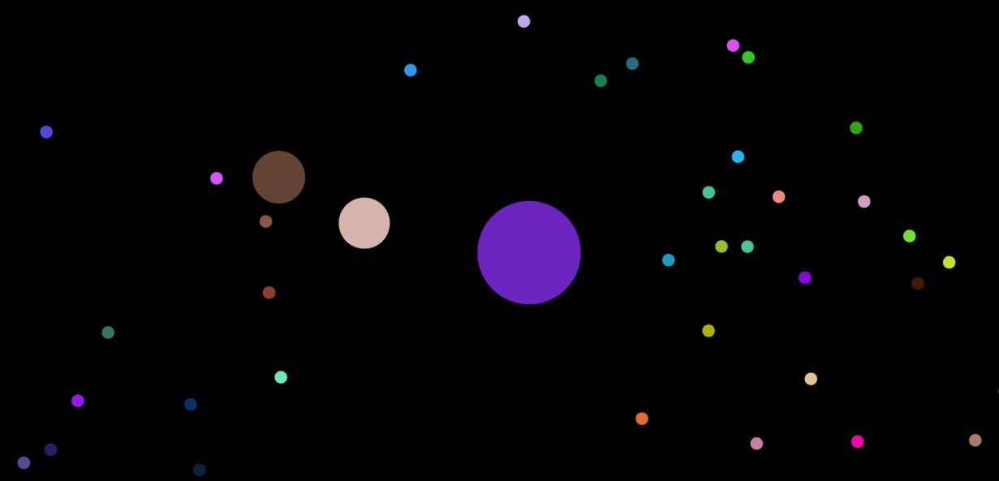
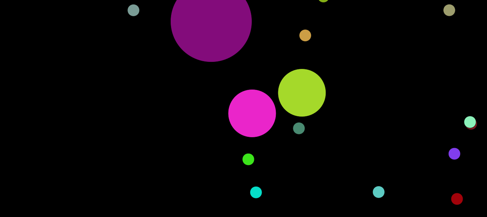

## Clone of [Agar.io](agar.io).

## Implementation Details 
Forked from [Daniel Shiffman](https://github.com/shiffman)'s Coding Challenge #32.
Node.js For backend.

## Setup
1. git clone https://github.com/hkirat/agar.io.git
2. cd agar.io
3. npm install
4. node server.js
5. Go to localhost:3001

## Function Details
 
 Sent Functions

	  playerAdded : Lets all the connected clients know that a new user has joined the game.
	  initialiseId : Initialises a unique id on the client side.
	  initialiseEnemies : Initialises the opponents in the room.
	  initialiseBlobs : Initialises blobs on the client side.

 Received Functions

	  position : Lets the server know the current position of a blob.
	  eat : Lets the server know which blob was eaten by the current blob.
	  ateUser : Lets the user server know if a particular blob was eaten.
	  disconnect : Received if a particular client disconnects.

## Screenshots

